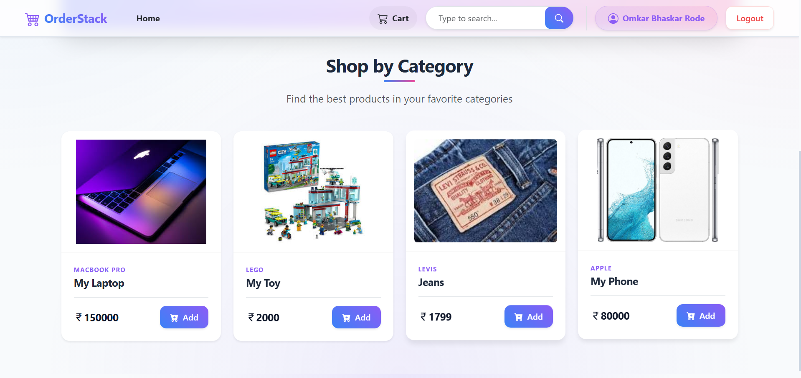
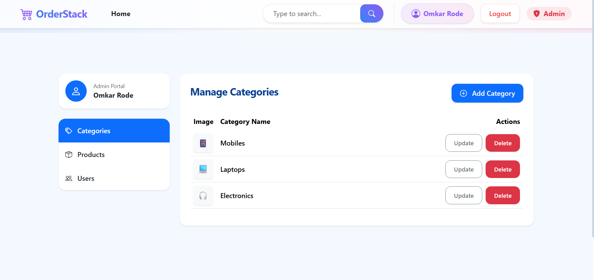
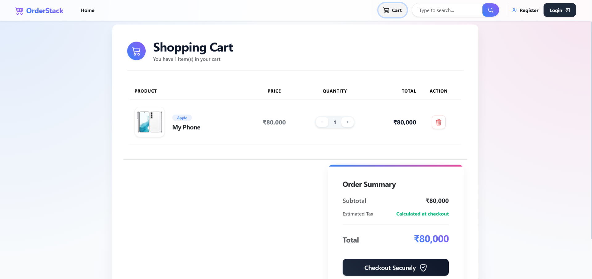
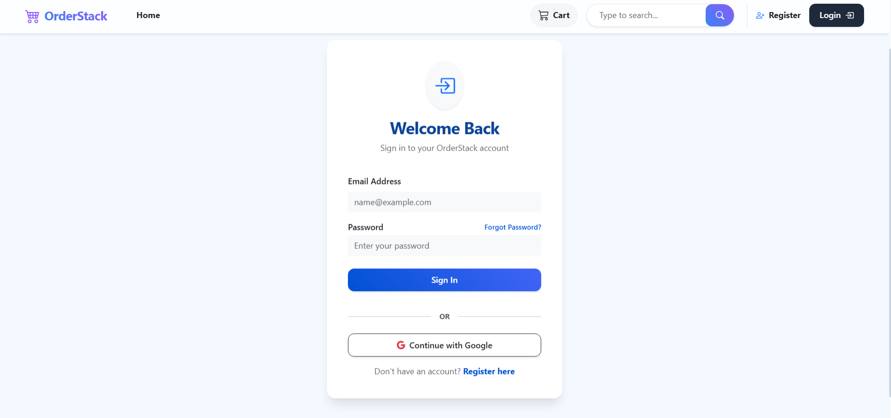
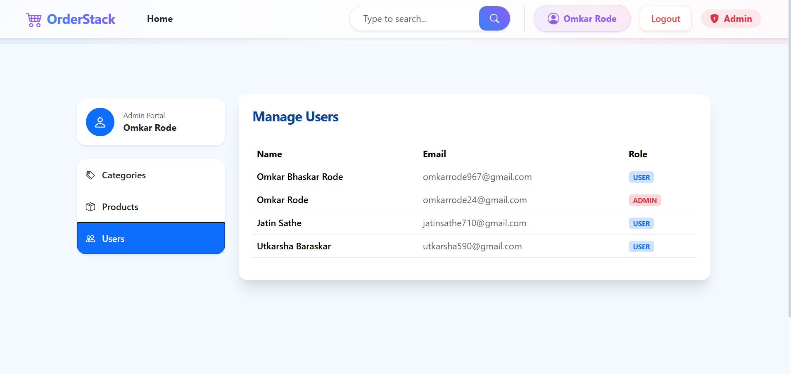
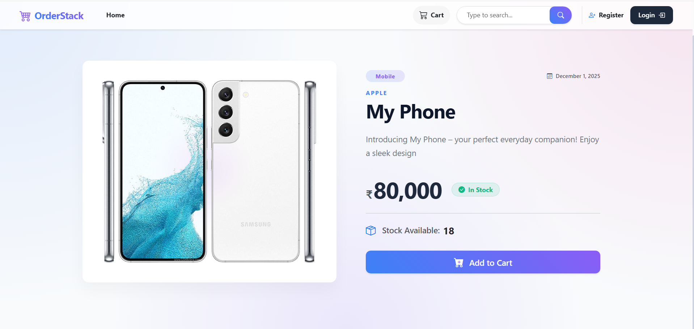
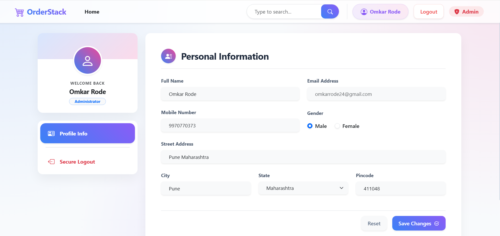
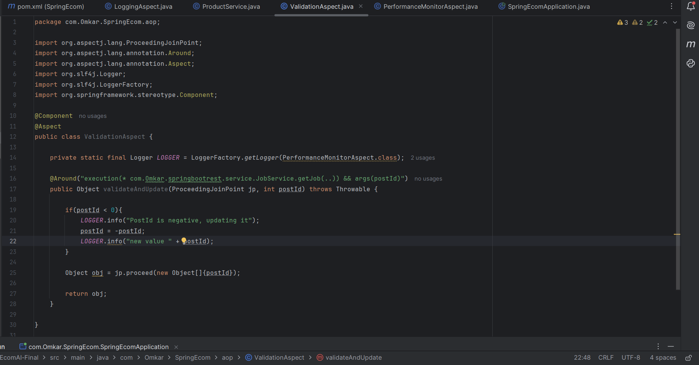
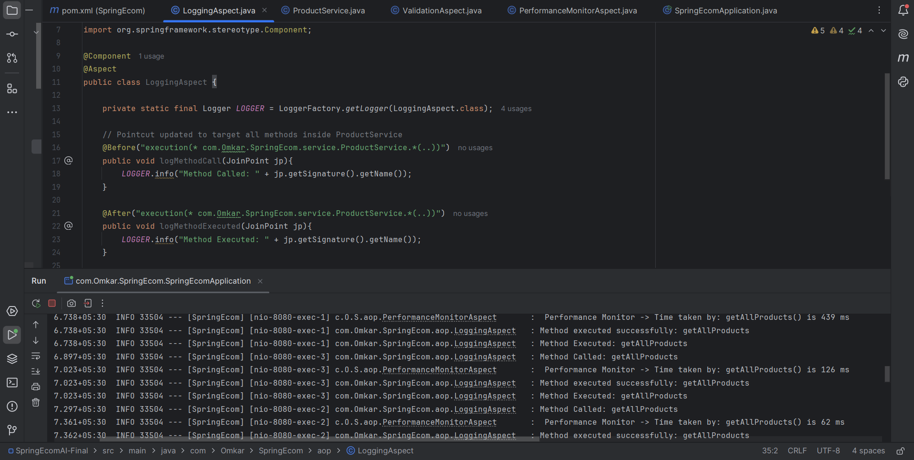

# 🛒 OrderStack | Enterprise-Grade AI Retail Platform


> A highly scalable, stateless full-stack e-commerce architecture. Engineered with a heavily secured Spring Boot RESTful API, PgVector-powered AI search capabilities, and a responsive, glassmorphism-driven React frontend.

---

## 📑 Table of Contents
* [System Architecture](#-system-architecture)
* [Deep Dive: Backend & Security](#-deep-dive-backend--security)
* [Deep Dive: Frontend & UI/UX](#-deep-dive-frontend--uiux)
* [Comprehensive Tech Stack](#-comprehensive-tech-stack)
* [API Reference](#-api-reference)
* [Environment Variables](#-environment-variables)
* [Installation & Deployment](#-installation--deployment)
* [Future Roadmap](#-future-roadmap)
* [Author](#-author)

---

## 🏗️ System Architecture

OrderStack is designed as a decoupled, monolithic client-server architecture built for high availability and strict security. 

* **The Presentation Layer (React):** Manages complex global states using the Context API (Cart, Auth, Theme) without relying on heavy external state libraries like Redux. UI components are styled using a custom glassmorphism design language over Bootstrap utility classes.
* **The Application Layer (Spring Boot):** Exposes 30+ secured RESTful endpoints. Utilizes Spring AOP for clean separation of cross-cutting concerns (logging, performance monitoring) from business logic.
* **The Persistence Layer (PostgreSQL):** Relational data management with PgVector extensions enabled for handling high-dimensional embeddings generated by Spring AI.

---

## 🛡️ Deep Dive: Backend & Security

### Stateless Authentication (JWT & OAuth2)
OrderStack strictly adheres to stateless backend architecture. Upon successful login, the server issues an encrypted JSON Web Token (JWT). The frontend stores this securely and attaches it as a Bearer token in the `Authorization` header of subsequent requests. 
* Prevents CSRF attacks inherently.
* Enables horizontal scaling without session replication bottlenecks.

### Role-Based Access Control (RBAC) & OWASP
Endpoints are aggressively protected using Spring Security's method-level security (`@PreAuthorize`).
* `ROLE_ADMIN`: Full CRUD capabilities over products, users, and global order history.
* `ROLE_CUSTOMER`: Restricted to personal profile management and individual cart/checkout processing.

### Aspect-Oriented Programming (AOP)
Instead of cluttering service classes with boilerplate logging, OrderStack uses Spring AOP. Aspect classes intercept method executions across the controller and service layers to automatically log request payloads, execution times, and unhandled exceptions.

### AI-Powered RAG Search
Integrated **Spring AI** to interface with embedding models. Product descriptions are vectorized and stored in PostgreSQL using **PgVector**. This allows users to perform semantic searches (e.g., "laptop for heavy gaming") rather than relying on basic SQL `LIKE` queries.

---

## 🎨 Deep Dive: Frontend & UI/UX

### "God Mode" Glassmorphism UI
The UI departs from standard material design, utilizing a premium CSS-driven approach:
* Fixed ambient radial-gradient backgrounds that persist cleanly during scrolling.
* CSS `backdrop-filter: blur()` applied to contextual overlays (Navbar, Cart, Profile Cards) to simulate frosted glass.
* Dynamic hover states utilizing `transform: translateY()` and soft drop-shadows for tactile user feedback.

### Advanced React Patterns
* **Hook-Driven Routing:** Utilizing `useLocation` to dynamically clear states (like search inputs) upon route changes.
* **Contextual State Isolation:** separating Authentication state from E-Commerce (Cart/Product) state for cleaner rendering cycles.
* **Blob Data Handling:** Efficiently parsing Base64/Blob image streams from the backend into dynamic `URL.createObjectURL` references to prevent heavy memory leaks.

---

## 💻 Comprehensive Tech Stack

| Domain | Technologies Used |
| :--- | :--- |
| **Frontend Core** | React.js (v18), React Router DOM, Context API |
| **Frontend Styling** | Bootstrap 5, Custom CSS3, React Toastify |
| **Backend Core** | Java 17, Spring Boot 3, Spring Web MVC |
| **Security** | Spring Security, JWT (io.jsonwebtoken), BCrypt |
| **Database & ORM** | PostgreSQL, PgVector, Hibernate, Spring Data JPA |
| **Artificial Intelligence**| Spring AI framework |
| **DevOps** | Docker, Docker Compose, Maven |

---

## 🔌 API Reference (Sample Endpoints)

| Method | Endpoint | Description | Access Level |
| :--- | :--- | :--- | :--- |
| `POST` | `/api/register` | Register a new user | Public |
| `POST` | `/api/login` | Authenticate and return JWT | Public |
| `GET` | `/api/products` | Fetch full catalog | Public |
| `GET` | `/api/products/search?keyword=` | Perform semantic/keyword search | Public |
| `GET` | `/api/users/{id}` | Fetch user profile data | `ADMIN`, `Self` |
| `PUT` | `/api/product/{id}` | Update product stock/details | `ADMIN` |
| `GET` | `/api/orders/my-orders` | Fetch user order history | `Authenticated` |

---

## 🔐 Environment Variables

To run this project, you will need to add the following environment variables to your respective `.env` and `application.properties` files:

**Frontend (`.env`)**
`VITE_BASE_URL=http://localhost:8080`

**Backend (`src/main/resources/application.properties`)**
`spring.datasource.url=jdbc:postgresql://localhost:5432/orderstack_db`
`spring.datasource.username=your_pg_user`
`spring.datasource.password=your_pg_password`
`jwt.secret=YOUR_512_BIT_SECURE_SECRET_KEY_HERE`

---

## ⚙️ Installation & Deployment

### 1. Clone the Repository

```bash
git clone https://github.com/Omkarrode967/OrderStack-Platform.git
cd OrderStack-Platform
```

## 📸 Project Visuals

Below are some key screenshots showcasing the OrderStack platform in action:

### Home Page


### Admin Portal


### Shopping Cart


### Login Page


### Manage Users


### Product View


### User Profile


### Validation Aspect Logs


### Logging Aspect Logs



